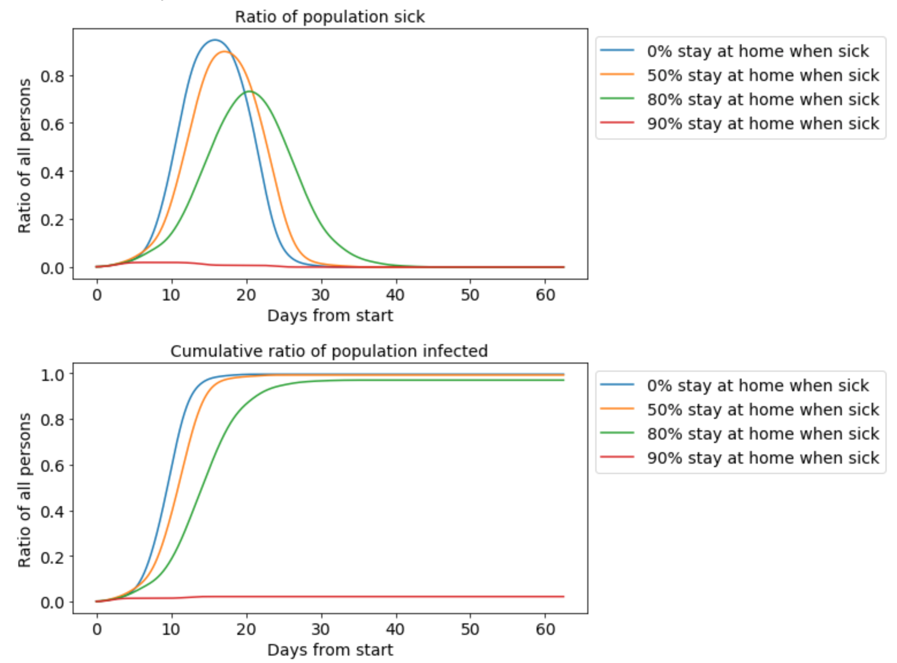

## Virus Spreading Simulator 

This is simple simulator program for modeling the virus spreading using the actual mechanisms (sneezing) for the virus transfer. 

The simulator models the persons and their common life events (life at home, work, studying at school, visiting shops) by simulating a typical day of life and repeating that day for the duration of the simulation. When a person is sick, the virus makes the person sneeze, which then transfers the virus to the nearby persons. The code is built to support sick leaves, vaccinations and other countermeasure options.

## Disclaimer
The simulation model is meant to play with the key concepts in virus spreading control. It does not give scientifically accurate results and the parameters have not be calibrated from any kind of official sources. 

In small scale simulations, such as the cases included in the code, different initialisation parameters can have large impact on the simulation results. To obtain reliable results one should run a Monte Carlo simulation containing e.g. 100 pcs of individual scenario simulations that have been initialized with different random variables, and then calculate summary statistics from the results. 